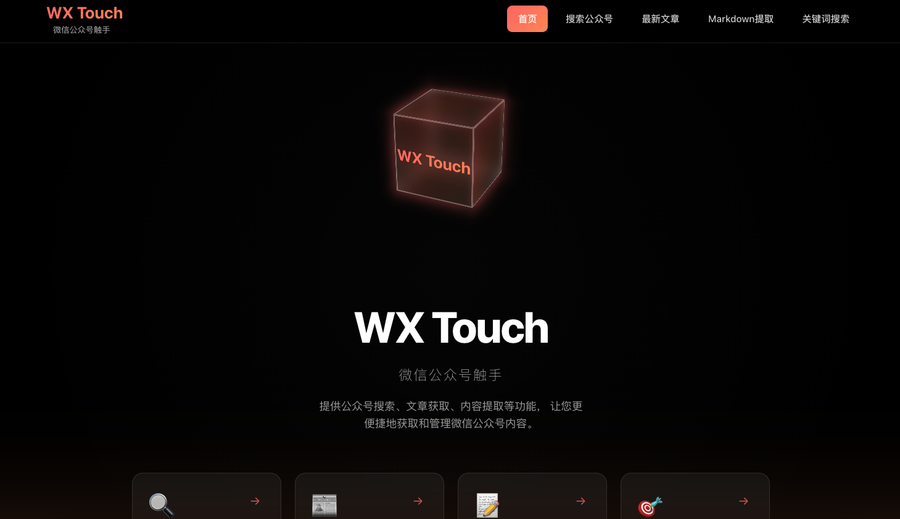

# WX Touch — 微信公众号触手

WX Touch 是一个基于 React + TypeScript + Vite 构建的前端应用，用于调用“微信公众号爬虫服务”提供的接口，实现以下核心能力：
- 搜索微信公众号
- 获取指定公众号的最新文章列表
- 提取文章内容为 Markdown
- 在指定公众号文章中进行关键词搜索

本项目遵循统一的代码与文档规范，默认使用 `reactbits` 作为 UI 组件库，并通过 MD5 签名认证与后端交互。

## 技术栈
- 前端框架：`React 18`、`TypeScript`
- 构建工具：`Vite`
- 路由：`react-router-dom`
- Markdown 渲染：`react-markdown` + `remark-gfm`
- 认证与签名：`crypto-js`

## 快速开始
前置要求：
- Node.js `>= 18`
- npm `>= 9`

安装与本地运行：
```bash
npm install
npm run dev
```

构建与预览：
```bash
npm run build
npm run preview
```

## 环境变量
在项目根目录创建 `.env` 文件（本地开发与生产环境均需设置）：
```env
VITE_API_KEY=你的APIKey
VITE_API_SECRET=你的APISecret
```
- 开发环境通过 Vite 代理使用相对路径访问 `/api`，见 `vite.config.ts`。
- 认证头包含：`x-api-key`、`x-timestamp`、`x-signature`（在前端根据 `apiKey + endpoint + timestamp + apiSecret` 计算 MD5）。

## 目录结构
```
wx-touch/
├── public/                  # 静态资源与公开文件
├── src/
│   ├── assets/              # 图片、图标等静态资源（构建内打包）
│   ├── components/
│   │   └── common/          # 通用布局与基础组件（默认使用 reactbits）
│   ├── pages/               # 业务页面（每个文件夹为一个路由页面）
│   │   ├── Home/            # 首页
│   │   ├── SearchAccount/   # 搜索公众号
│   │   ├── LatestArticles/  # 最新文章列表
│   │   ├── ExtractMarkdown/ # 文章 Markdown 提取
│   │   └── KeywordSearch/   # 关键词搜索
│   ├── services/            # 与后端交互的服务层
│   │   └── api.ts           # 微信公众号爬虫 API 封装
│   ├── styles/              # 全局与页面样式（含 App.css, index.css）
│   ├── types/               # TypeScript 类型定义入口
│   ├── App.tsx              # 应用路由与顶层布局组合
│   └── main.tsx             # 应用入口（挂载 Root）
├── index.html               # 单页应用入口 HTML
├── vite.config.ts           # Vite 配置（代理、别名、构建设置）
├── package.json             # 依赖与脚本
└── .env.example             # 环境变量示例（复制为 .env 使用）
```

路径别名（见 `vite.config.ts`）
- `@pages` 指向 `src/pages`
- `@components` 指向 `src/components`
- `@/` 指向 `src` 根目录

核心路由（见 `src/App.tsx`）
- `/` → `Home`
- `/search-account` → `SearchAccount`
- `/latest-articles` → `LatestArticles`
- `/extract-markdown` → `ExtractMarkdown`
- `/keyword-search` → `KeywordSearch`

服务层 API 封装（见 `src/services/api.ts`）
- 类 `WeChatCrawlAPI`：封装认证、请求与常用方法
- 方法：
  - `searchWeChatAccount(search)` 搜索公众号
  - `getLatestArticles(nickname, count?)` 获取最新文章
  - `extractArticleMarkdown(url)` 提取文章为 Markdown
  - `searchArticlesByKeyword(keyword, nickname, searchType?, count?, offset?)` 关键词搜索
- 导出：`apiService` 单例与默认导出，便于各页面直接调用

## 页面与路由
- `/` 首页：视觉引导与功能入口
- `/search-account` 搜索公众号
- `/latest-articles` 最新文章列表
- `/extract-markdown` 文章 Markdown 提取
- `/keyword-search` 关键词搜索

路由定义见 `src/App.tsx`，所有页面都包裹在通用 `Layout` 中，统一导航与内容区域结构。

## API 使用概览
封装位置：`src/services/api.ts`
- 基础地址：开发环境使用相对路径（Vite 代理到 `https://wxcrawl.touchturing.com`），生产环境读取 `VITE_API_BASE_URL`
- 认证方式：在请求头注入 `x-api-key`、`x-timestamp`、`x-signature`
- 核心接口：
  - `/api/search` 搜索公众号（参数：`search`）
  - `/api/latest_articles` 最新文章（参数：`nickname`, `count`）
  - `/api/extract` 提取 Markdown（参数：`url`）
  - `/api/keyword_search` 关键词搜索（参数：`keyword`, `nickname`, `search_type`, `count`, `offset`）

类型定义见 `src/types/index.ts`，包括公众号信息、文章信息、通用响应体等。

## 开发规范
- 注释要求：
  - 每个文件需在顶部说明该文件实现的功能与职责。
  - 每个函数需编写详细注释，包含参数、返回值、可能的异常。
  - 修改代码后需同步更新相关注释。
- 命名约定：
  - 函数与变量使用驼峰命名法（`camelCase`）。
  - 类名使用帕斯卡命名法（`PascalCase`）。
- UI 组件库：默认使用 `reactbits`（除非另行说明）。

## 常用命令
```bash
npm run dev         # 启动本地开发服务器
npm run build       # 生产构建
npm run preview     # 本地预览构建产物
npm run lint        # ESLint 检查
npm run type-check  # TypeScript 类型检查
```


## 贡献指南
- 提交改动前请运行 `npm run lint` 与 `npm run type-check`。
- 保持代码与文档注释同步更新。
- 遵循上述开发规范与统一风格。

## power by[HeteroCat](https://github.com/HeteroCat)